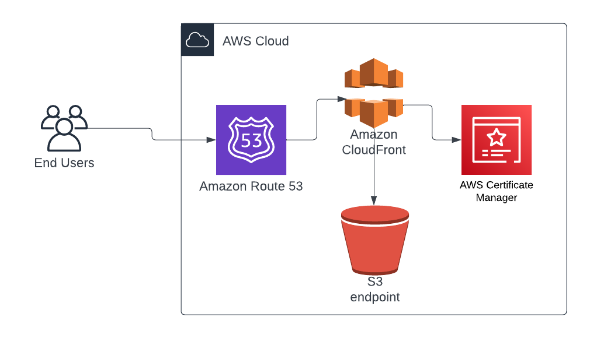

# Personal-Website
This project demonstrate how to deploy a static website to AWS using AWS S3 and Route53.



<!--  -->
### Prerequisites.
* **You should have a domain name already purchased to link with your Static Website. You can use whogohost.com**
* **Your Website content to display on your domain.**
* **You have full access to Rout53 and S3.**
  
### By the end of this post you will be able to: 
* **Create an S3 bucket and Configure it for static website hosting.**
* **Create a record in Route 53.**
* **Then Finally Link the S3, Custom Domain via Route 53 To access your website.**
### Here is a sample of how it should look like.


## Steps 

1. Create a S3 bucket using the same name as you domain name 


2. Allow public access to the bucket.


3. Upload the files and folders from your local computer to the S3 bucket.


4. Change the Bucket Policy in the permissions tab to allow access to the content of the bucket.

```
{
    "Version": "2012-10-17",
    "Statement": [
        {
            "Sid": "PublicReadGetObject",
            "Effect": "Allow",
            "Principal": "*",
            "Action": "s3:GetObject",
            "Resource": "arn:aws:s3:::oluwaseunadeyo.com.ng/*"
        }
    ]
}
```

5. Enable Static Website hosting in the bucket properties tab.


6. Create a simple routing record in the same region as your s3 bucket in your already created hosted zone.

Note: the hosted zone should have the same name as your domain name

7. Wait a while and you should see your website up and kicking
